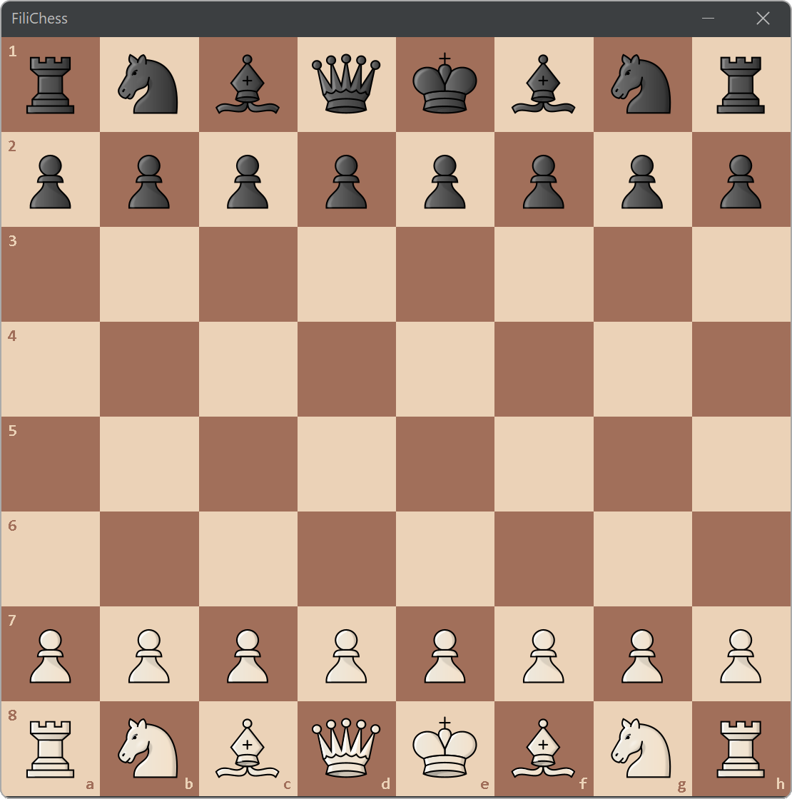

# JavaChess (Not Finished)

  
  
  
  

<h4 align="center">The classic <b><a href="https://en.wikipedia.org/wiki/Chess">Chess</a></b> game made in Java. Simpler for the user, light, fast
and beautiful. What more do you want?</h4>

  <a href="#about">About 📚</a>
  <a href="#license">Features ♟</a>
  <a href="#license">Future features ⚒</a>
  <a href="#license">License 📜</a>

  
    
<i>Kaspárov vs Deep Blue 1997 represented in JavaChess</i>

## About 📚

Chess is that kind of board game that we all have played once in our lives. Who could imagine that 6 different pieces with a few rules could be
that complicated, at the point that with a normal pc, the time for this to generate all the possible moves and combinations in a chess game would
last aproximately the same time that ages the univesre has.

Anyway, this chess game is made for 2 players, and it won't have an AI at this moment. Maybe in later versions of the game, JavaChess would have an
AI like <a href="https://github.com/Filipondios/TicTacToe">my TicTacToe</a> game has, but you'll need to wait a bit...

## Features ♟
The actual features that are implememnted in the game are:

<i>Nothing to show at this moment</i>

## Future features ⚒
The future features that will be implemented, in order are:

- `#1` : 1v1 game (human vs human)
- `#2` : Chess and pieces customization : The user could be able to chage the pieces and board theme.
- `#3` : Custom location/configuration of the pieces in the board when starting the app.
- `#4` : Chess AI

## License 📜
GNU - See the license <a href="LICENSE">file</a>.
