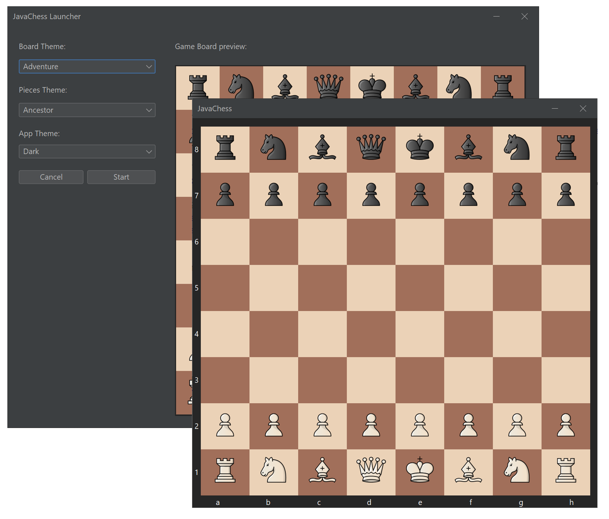

# JavaChess (Not Finished)

<!-- Repo Badges -->

  
  
  
  

<!-- Project/App resume -->
<h4 align="center">
The classic <b><a href="https://en.wikipedia.org/wiki/Chess">Chess</a></b> game made in Java. Simpler for the user, light, fast
and beautiful. What more do you want?
</h4>

<!-- Quick Link -->

  <a href="#about">About :book:</a> •
  <a href="#license">Features :wrench:</a> •
  <a href="#contrib">Contributing :speech_balloon:</a> •
  <a href="#credits">Credits :clipboard:</a> •
  <a href="#license">License :open_file_folder:</a>

<!-- App preview -->

  
    
<i>JavaChess Launcher (in front) and JavaChess (behind)</i>

<!-- About the app -->

## About :book:

Chess is that kind of board game that we all have played once in our lives. Who could imagine that 6 different pieces with a few rules could be
that complicated, at the point that with a normal pc, the time for this to generate all the possible moves and combinations in a chess game would
last aproximately the same time that ages the univesre has.

Anyway, this chess game is made for 2 players, and it won't have an AI at this moment. Maybe in later versions of the game, JavaChess would have an AI like <a href="https://github.com/Filipondios/TicTacToe">my TicTacToe</a> game has, but you'll need to wait a bit...

<!-- Implemented and not implemented features -->

## Features :wrench:
The actual features that are implememnted in the game are (***only marked with the :white_check_mark:***):

- [x] : Game customization
  - [x] : Custom pieces
  - [x] : Custom colors for the board
- [ ] : 1v1 game (human vs human)
- [ ] : Custom location/configuration of the pieces in the board when starting the app.
- [ ] : Chess AI

## Contributing :speech_balloon:

Any contributions you make are **greatly appreciated**.

If you have a suggestion that would make this better, please fork the repo and create a pull request. You can also simply open an issue. Don't forget to give the project a :star:!

1. Fork the Project
2. Create your Feature Branch (`git checkout -b feature/SomeFeature`)
3. Commit your Changes (`git commit -m 'Add some SomeFeature'`)
4. Push to the Branch (`git push origin feature/SomeFeature`)
5. Open a Pull Request
  
<!-- Credits -->

## Credits :clipboard:
- The pieces colleaction are from: <a href="https://github.com/Ka-hu/chess-pieces">Ka-hu/chess-pieces</a>
- The basic board colors are from: <a href="https://www.youtube.com/watch?v=U4ogK0MIzqk&t=285s">Sebastian Lague-Coding Adventure: Chess</a>
- Some ideas to identify the pieces were also extracted from: <a href="https://www.youtube.com/watch?v=U4ogK0MIzqk&t=285s">Sebastian Lague-Coding Adventure: Chess</a>

<!-- License -->

## License :open_file_folder:
GNU - See the license <a href="LICENSE">file</a>.
